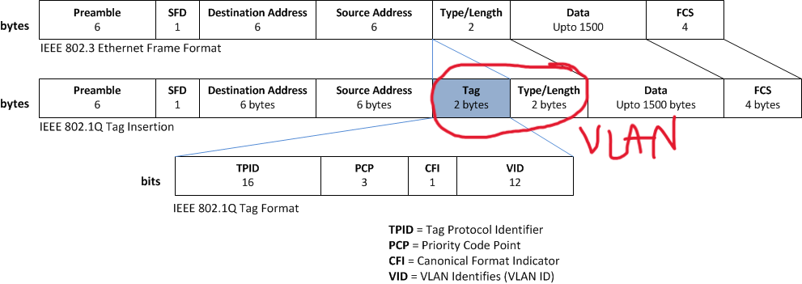
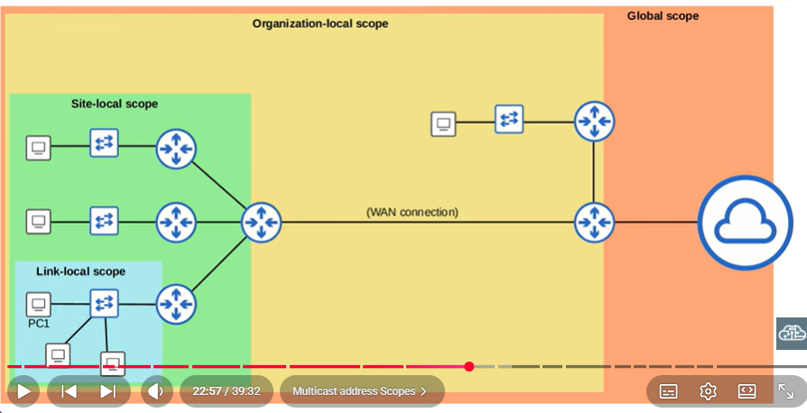

## Ethernet 


```
PREAMBLE: 7 bits
SFD: Start Frame Delimiter 1
------------------------- not considered
MAC DEST: 6 
MAC SRC: 6
TYPE: 2
*VLAN_TAG 2x2
PAYLOAD
FCS: Frame check Sum 4
```
- Multiple Vlans: 802.1q with VLAN tagging
    - headers: 18 bytes
    - payload: 42 to 1500 bytes
    - MIN: 64 bytes and 1518 max
- Eth: 802.3
    - headers: 22 bytes
    - payload: 42 to 1500 bytes
    - MIN: 64 bytes and 1522 max
    
- CIDR: class inter domain routing, before the network size was infered by the IP. A 0-127 B 128-191 C 192
## ARP

- <u>Gratuitous ARP</u>: to update caches without an ARP REQUEST. E/g change of router ip 
- <u>Prove ARP</u>: SRC.IP empty so it doesn't update the caches
- <u>Proxy ARP</u>: NAT


show arp -> L3 devices with ARP cache
   - includes local interfaces
   - swL3 Vs router : NAT & tunneling
sh mac-address-table -> L2 devices with CAM MAc-IP map
   - local interfaces do not have IP
clear arp cache -> in L3 (?)

## VLAN

-  Broadcast domain (vlan) != collision domain (link)
- L3 devices might not support vlan
- VLSM : variable lenght subnet masking
- Router: subinterfaces. Assigns multiple ips to the same interface. 
    > This allows to define a default gatweay for each VLAN pointing to the same physical interface.
    ```
    By default applies 802.1q encapsulation to the sub-interfaces
    
    interface FastEthernet0/0.22
        encapsulation dot1q 22
        ip address 192.168.8.1 255.255.255.128
    ```


## Ath

- secret Vs password: 
    - secret is encrypted
    - enable secret first option, then fallback to password if present
- enable Vs vty:
    - vty ssh/telnet enable for exec mode


## Startup config

- Management setup Vs normal setup: the managment is for the network adm.
## OBS
- Config L3 switch 


## Configs

Router:
 - Set up ips on each interface (already up)
Switch
 - Configure Vlan1 (basic)
    - No need to configure all the interfaces (?)


## Auth
- configure VTY password
```
line vty 0 4
   password cisco
```

## Configure a Vlan


```
interface vlan X
    ip address X X
```

## Interfaces L2 Debug

- duplex/speed might not be matching that if the status is conected, there is connectivity.
```

sh interfaces <interface> -> error counters (runts, giants, CRC)
sh interfaces status
    PortName      Status       Vlan    Duplex  Speed Type
    Fa0/1         connected    trunk     half    100 10/100BaseTX
    Fa0/2         notconnect   1         auto   auto 10/100BaseTX
    Fa0/3         notconnect   1         auto   auto 10/100BaseTX
    Fa0/          notconnect   1         auto   auto 10/100BaseTX
```

- duplex mismatch: hard to identify, intermitent problems with status `conected`. It can generate `collisions`
- speed mismatch: intermitedn up/down also hard to identsify
- half duplex use -> CSMA/CD (same as wireless)


L1 problem
```
FastEthernet0/1 is down, line protocol is down
```

By default:
- routers are administratively downs/down 
- ip fbreif amdministrative down == diasble in status
- show interfaces status do not work in routers

```
FastEthernet0/1 is <Status>, line protocol is <Line Protoco>
```

| Status  | Line Protocol | Description |
|---------|----------|----------|
| Up | Up | L1 L2 ok
| AdmDown | Down | shutdown command or default in router |
| Down | Down | L1 problem, or device off in the other endpoint |
| Up | Down | Configuration mismatch: speed, duplex |
| Down | Down (err-disable)  | network shutsdown the interface to protect |
|---------|----------|----------|
| Up | Up  | orange light -> stp disabled |

How to debug interfaces:
- show interfaces status: speed and duplex must be matching
- show interfaces <name> status and line protocol must be up
- check STP: show spanning-tree interface <name>
```
Vlan             Role Sts Cost      Prio.Nbr Type
---------------- ---- --- --------- -------- --------------------------------
VLAN0001         Altn BLK 19        128.2     P2p

Vlan             Role Sts Cost      Prio.Nbr Type
---------------- ---- --- --------- -------- --------------------------------
VLAN0001         Root FWD 19        128.1     P2p
```

```
sh interface status -> L1 status
```

```
sh interface <interface>> -> L1 and L2 status
```

## Vlans


- Vlan is not the same as the SVI. This is
```
interface vlan1 != vlan

interface Vlan1 
    shutdown 
    ! this is the SVI L3 not the vlan it self
```

- SVI in ç2 switches are important to be able to reach them from managment and ping them

## Routing

#### L3 Switches

```
(config) ip routing -> to activate
(config-if) no switchport 
```

### How to desing a network

1. Define topology
2. Count number of VLANs + 1 mngt (broadcast domains/subnets)
4. Count IP addresses:
    2.1. Count number of L3 interfaces per VLAN
    2.2  Count number of L3 network devices (loopbacks*SVI) mngt
2.3 Pluss can be the loopbacks wich can be the same as the mngt. All network devices

```

```

obs: subnets can be assigned sequentially starting from the smallest

Result: number of needed VLANs, IPs and mngs Ips

### Implementing the design

1. Design vlans and interfaces + mngmt vlan
1. Assing mngnt vlan to all devices
2. Configure vlans 
    2.1 in p2p interce by interface setting the proper mask
    2.2 in access vlans range of interfaces + uplink 

1. Start by configuring smaller vlans IP by IP. Open the terminal only of the involved devices.
2. Assing ip, mask and default gateway to PCs
3. Assign default gateway
4. Assing SVI middle switches (to manage)

### boson implement ipv4 config

Desging
1. List vlans, their masks and hosts
    1.1 p2p vlans
    1.2 access vlans

implement
2. R1, R2, R2 Assign p2p + loopbacks in routers - gigabitethernet interfaces
> no test
3. DSW1, DSW2, DSW3 Assign p2p ips to L3 switches
> no test
4. DSW1, DSW2, DSW3, AWS1, AWS2, AWS3, ASW4 vlan1 interfaces
> no test
5. DSW1, DSW2, and DSW3 vlans 100, 200, 300, 400
    5.1 ip vlan interface in DSW
    5.2 ip and /dg in hosts of vlan
    > ping gateway

## 3 IPv6

- 8 x 4 x hexa = 128 bits
- Cut the largest amount of consecutive zeros
- network:network:network:custom:host:host:host:host / 34
- for a network N:N:N:custom /64
- /9 or /93 are masks which are not multiple of 4. Need to break up the hexa number.
    - xxxx:xxxx:0:FEED:DAD:18F:xxx:xxxx/62 -> xxxx:xxxx:0FEEC:: / 62
- No ARP -> NDP : network discovery protocol
    - NS solicitation MEssageL NS
        - instead of empty deest: solicitaded-node multicast address <u>instead of broadcast</u>
    - NA network advertisement
    - RA and RS router Advertisement and Solicitation
    - also router solicitation and adversitesements
- DAD: duplicate addres detection. Just sends an NS and waits for a NA.
- Directly attached routes <u>wont work in ipv6</u> (next hop as interface). Use filly speficied or recursive
- SLAAC: stateless address autoconfiguration. Generates based on the local link and EUID automatically. Based on the RA to set the network part and on the EUID to set the host one.
```
(SLAAC) ipv6 address autoconfig
```
- EUI: extendedn unique identifier: FFFE in the middle of the MAC
- to debug an interface
```
sh ipv6 interface fastethernet 0/3
```
- always add
```
ipv6 unicast-routing
```
- Broadcast domain addresses: Multicast ipv6 scopes by domain or protocol
    - 
- Collision domain addresses: link-local addresses, private for each link. 
- 2^128 / 2^32 more addresses
- Extended Unique Identifier: uses a U/L bit to identify if the address is global or either local unique
    
#### ipv6 addresses types
- global unicast: need to be reserved
    - XXXX:XXXX:XXXX:SSSS:HHHHH:HHHH:HHHH:HHHH
    - X global unique
    - S subnet 
    - H: Extended Unique Id from MAC address -> no need of DHCP
        - half MAC inter <u>FFFE</u> and invert 7th bit
```
(config-if) ipv6 address xxxx.xxxx.xxxx.xxx/64 eui-64
```
- unique local:  set private not routed (broadcast domain)
    - <u>FDXX</u>:XXX:XXX:SSSS:HHHH:HHHH:HHHH:HHHH
    - X global id (private) random
    - S subnet
    - H EUID
```
(config-if) ipv6 address FDxx.xxxx.xxxx.xxx/64 eui-64
```
- link-local:
    - <u>FE80::/10</u> (collison domain)
    - <u>auto generated, uses EUID</u> when ipv6 enables in the interface or a global/unique one is set
    - Routers do not forward traffic sent to a link-local address; the traffic stays on the local link
    
```
(config-if)# ipv6 enable
```
- localhost
- multicast - defined by protocol/scope
    - <u>FF01::</u> in device
    - <u>FF02::</u> by protocol
    - <u>FF05::</u>
    - <u>FF08::</u>
- :: all zeros (not specified)


When an ipv6 interface gets configured it is assign a local-link address (FE80) and it is added to the multicast groups (FF02). This configuration can be via enabling ipv6 on the interface or by assining an ipv6 address to it.
```
FastEthernet0/3 is up, line protocol is up
  IPv6 is enabled, link-local address is FE80::20C:42FF:FE60:8261
  No Virtual link-local address(es):
  Global unicast address(es):
    2001:DB8:C::1, subnet is 2001:DB8:C::/64
  Joined group address(es):
    FF02::1
    FF02::2
    FF02::1:FF00:1
    FF02::1:FF60:8261

```

### Routing
- floating route: smaller Administrative Distance to force it on top of others
- assign /30 to p2p in the exam. Always leave for broadcast and network ip

## MAC 

- 300s of item in the mac-address-table
- CAM is the memory NVRAM (non-volatile ram) is the hard disk